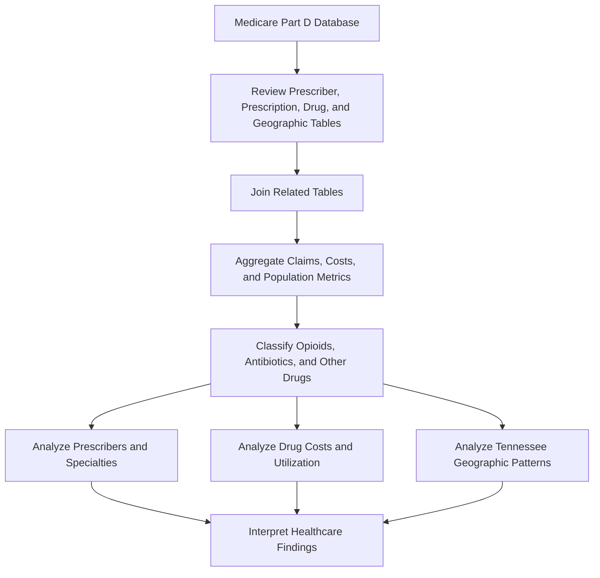

# Medicare Part D Prescriber SQL Analysis

> **Individual SQL Portfolio Project | PostgreSQL • Healthcare Analytics • Medicare Part D Data**

## Project Overview

This project analyzes prescribing patterns using a PostgreSQL database derived from the **Medicare Part D Prescriber Public Use File**.

The analysis investigates prescription claim volume, provider specialties, opioid utilization, drug costs, geographic patterns, and prescribing behavior. It demonstrates how SQL can be used to integrate healthcare provider, prescription, drug, and population data to answer practical healthcare analytics questions.

This project was completed individually as part of the **Nashville Software School Data Science program**.

---

## Project Objectives

- Identify the highest-volume prescribers and specialties
- Analyze opioid utilization by medical specialty
- Compare drug costs and cost per day supplied
- Classify opioids, antibiotics, and other medications
- Explore Tennessee CBSA and county population patterns
- Build a complete Nashville pain-management provider–opioid claims matrix

---

## Dataset

The project uses a PostgreSQL database derived from the **Medicare Part D Prescriber Public Use File**.

The repository includes:

- A PostgreSQL database backup in the `data/` directory
- The Medicare Part D Prescriber PUF methodology document
- An Entity Relationship Diagram (ERD)
- A SQL script containing completed analytical queries and written interpretations

### Major Tables Used

| Table | Purpose |
|---|---|
| `prescriber` | Provider names, locations, and specialty information |
| `prescription` | Prescription claim counts, drug costs, and day-supply information |
| `drug` | Drug classifications, including opioid and antibiotic indicators |
| `cbsa` | Core Based Statistical Area information |
| `population` | County-level population data |
| `fips_county` | County names and FIPS code reference data |

---

## SQL Concepts Demonstrated

- `INNER JOIN`
- `LEFT JOIN`
- `CROSS JOIN`
- `CASE` expressions
- `COALESCE`
- Aggregate functions
- `GROUP BY`
- `HAVING`
- `ORDER BY`
- Conditional aggregation
- Null handling
- Geographic analysis

---

## Analytical Workflow



---

## Key Analyses

### Prescriber and Specialty Analysis

- Highest-volume prescriber
- Claims by medical specialty
- Specialties without associated prescriptions
- Opioid claim percentage by specialty

### Drug and Cost Analysis

- Highest total drug cost
- Highest cost per day supplied
- Opioid versus antibiotic spending
- High-volume prescriptions and opioid status

### Geographic Analysis

- Tennessee CBSA counts
- Largest and smallest CBSAs by population
- Largest county outside a CBSA

### Nashville Pain Management Analysis

A `CROSS JOIN` creates all combinations of Nashville pain management specialists and opioid drugs. A `LEFT JOIN` preserves combinations with no recorded claims, and `COALESCE` replaces missing claim counts with zero.

---

## Selected Findings

- Prescription claim totals varied substantially across medical specialties.
- Surgical and pain-related specialties showed some of the highest opioid claim percentages.
- Total spending on opioids exceeded total spending on antibiotics in the analyzed dataset.
- Cost per day supplied provided a different perspective from total drug spending.
- Geographic joins supported comparisons across Tennessee CBSAs and counties.
- The final query produced a complete Nashville pain-management provider–opioid matrix, including zero-claim combinations.

---

## Entity Relationship Diagram


---

## Repository Structure

```text
prescribers-sql-analysis/
├── README.md
├── prescribers.sql
├── data/
├── ERD.png
└── Part D Prescriber PUF Methodology 2019-03-29.pdf
```

---

## Technologies Used

| Category | Technology |
|---|---|
| Database | PostgreSQL |
| Query Language | SQL |
| Domain | Healthcare Analytics |
| Dataset | Medicare Part D Prescriber Public Use File |
| Documentation | Markdown |
| Version Control | Git and GitHub |

---

## Skills Demonstrated

- SQL
- PostgreSQL
- Healthcare data analysis
- Relational database analysis
- Multi-table joins
- Aggregate reporting
- Conditional aggregation
- Drug classification
- Opioid utilization analysis
- Geographic analysis
- Null handling with `COALESCE`
- Technical documentation

---

## Acknowledgment

This project uses a database derived from the **Medicare Part D Prescriber Public Use File**.

The project was completed individually as part of the Nashville Software School Data Science curriculum. The SQL queries and written interpretations in this repository represent my own analytical work.